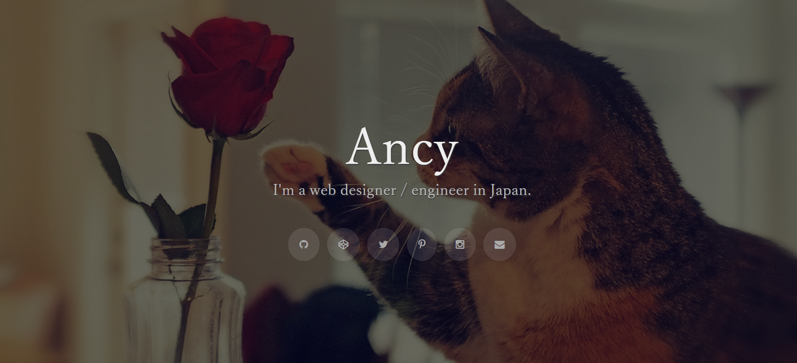
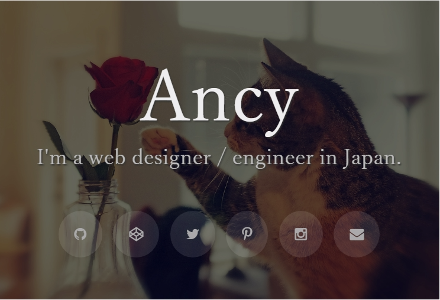
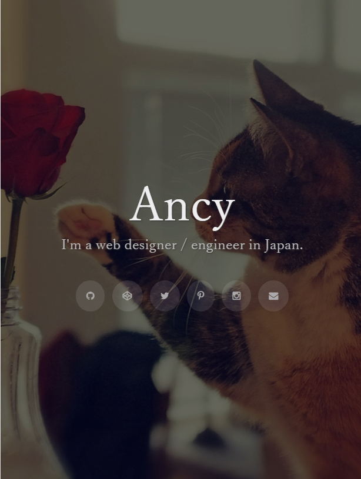

# Summarys

Less is a Portfolio template. It will easily correspond to basic SEO, OGP, twitter card and collect your social link page.
(Sorry, This "Less" is not the CSS pre-processor. X[ )

This theme not use js, It's a very simple portfolio. You can easily customize it too!

## Demo
[View Demo](http://lazulirose.com/less-demo/)



## Installation

Note: Summarys uses Jekyll. Please read [Jekyll's documentation](https://jekyllrb.com/) if you get stuck.
Fork this repo, clone it, and then run:
```
bundle install
```
...which installs github-pages gem. After that, run the server:
```
jekyll srver
```
Please check with localhost.

# Usage

Editing Your like styles

Edit `stylesheets/less.scss` like this:

```
// setting

$img: "http://farm7.static.flickr.com/6217/6341166445_daccd3fcce_b.jpg";
$img-filter: rgba(0,0,0,0.6);
$font: serif;
$main-text-color: #eee;
$sub-text-color: #bbb;
$text-shadow-color: #333;
$link-color: #aaa;
$link-color-hover: #77D9D3;

```

- img
 - "img" has been responsive image compliant.
- img-filter
 - Style for setting translucent color on image.
- font
 - Set your favorite font.
- main-text-color
 - It's your name text color.
- sub-text-color
 - It's discription text color.
- text-shadow-color
 - Set your name and discription text shadow
- link-color
 - It's social links color
- link-color-hover
 - It's hover change for social links color

---
Edit `_data/summary.yml` like this

```
name: "Ancy"
copy: "I'm a web designer / engineer in Japan."

```

Edit `_data/sns.yml` like this
```
## SNS ID, link, e-mail
github:  "lazulirose"
codepen: "lazulirose"
twitter: "lazulirose_ancy"
facebook: "lazulirose.ancy"
pintarest: "lazulirose_ancy"
instagram: "lazulirose_ancy"
mail: "lazuliroseancy@gmail.com"

```
What you do not need can be erased with `_includes/nav.html`, Or, please add the link you want.
I used `<a>` and [fontawesome](http://fontawesome.io/).
From fontawesome, use find the necessary icon.


Edit `_data/seo.yml` like this
```
## comon
site-name: "Ancy"
url: "http://lazulirose.com/"
description: "Portfolio　Template less demo"
keywords: "designer, engineer, portfolio"

## facebook
facebook-title: "Portfolio　Template less demo"
facebook-img: "https://avatars3.githubusercontent.com/u/28818572?v=3&s=460"
facebook-id: "556138191440732"
locale: "ja_JP"

## twitter
twitter-card: "summary_large_image"
twitter-id: "@lazulirose_ancy"
twitter-img: "https://avatars3.githubusercontent.com/u/28818572?v=3&s=460"
domain: "lazulirose.com"


```

- description is also used in og and twitter

---

## Responsive
This theme also supported mobile



## Author & License

Ancy

- [Website](http://lazulirose.com/)
- [Twitter](https://twitter.com/lazulirose_ancy)
